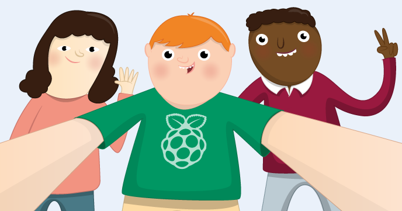

# Getting Started with Picamera

Get started with the Raspberry Pi Camera Module using Python and the picamera module. You'll take still pictures, record video and apply image effects.

## Requirements

As well as a Raspberry Pi with an SD card loaded with Raspbian Jessie, you'll also need:

### Hardware

- [Raspberry Pi Camera Module](https://www.raspberrypi.org/products/camera-module/)

## Worksheet

- [The worksheet](worksheet.md)

## Licence

Unless otherwise specified, everything in this repository is covered by the following licence:

***Getting Started with Picamera*** by the [Raspberry Pi Foundation](https://www.raspberrypi.org/) is licensed under a [Creative Commons Attribution 4.0 International Licence](http://creativecommons.org/licenses/by-sa/4.0/).

Based on a work at https://github.com/raspberrypilearning/getting-started-with-picamera
