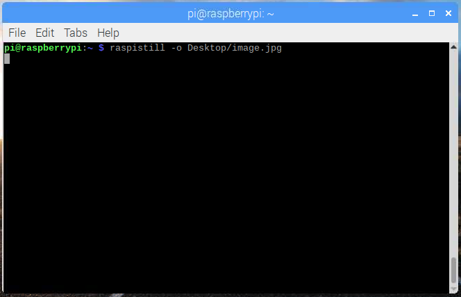

## كيفية التحكم في وحدة الكاميرا بواسطة سطر الأوامر

الآن وحدة الكاميرا الخاصة بك متصلة والبرمجيات مفعلة، جرب أدوات سطر الأوامر `raspistill` و `raspivid`.

- افتح نافذة طرفية بالنقر على أيقونة الشاشة السوداء في شريط المهام:


- اكتب الأمر التالي لالتقاط صورة ثابتة وحفظها على سطح المكتب:

```bash
raspistill -o Desktop/image.jpg
```



- اضغط على <kbd>Enter</kbd> لتشغيل الأمر.

عند تشغيل الأمر ، يمكنك مشاهدة معاينة الكاميرا مفتوحة لمدة خمس ثوان قبل التقاط صورة ثابتة.

- ابحث عن أيقونة ملف الصورة على سطح المكتب، وانقر مرتين على أيقونة الملف لفتح الصورة.

    

بإضافة خيارات مختلفة ، يمكنك ضبط حجم ومظهر الصورة التي يأخذها الأمر `raspistill`.

- على سبيل المثال، أضف `-h` و `-w` لتغيير ارتفاع وعرض الصورة:

```bash
raspistill -o Desktop/image-small.jpg -w 640 -h 480
```

- الآن قم بتسجيل فيديو باستخدام وحدة الكاميرا باستخدام الأمر التالي `raspivid`:

```bash
raspivid -o Desktop/video.h264
```

- لتشغيل ملف الفيديو ، انقر نقرًا مزدوجًا فوق أيقونة الملف `video.h264` على سطح المكتب لفتحه في VLC Media Player.

لمزيد من المعلومات والخيارات الأخرى التي يمكنك استخدامها مع هذه الأوامر ، اقرأ الوثائق التعليمية [لـ raspistill](https://www.raspberrypi.org/documentation/usage/camera/raspicam/raspistill.md) و [الوثائق التعليمية raspivid](https://www.raspberrypi.org/documentation/usage/camera/raspicam/raspivid.md).
