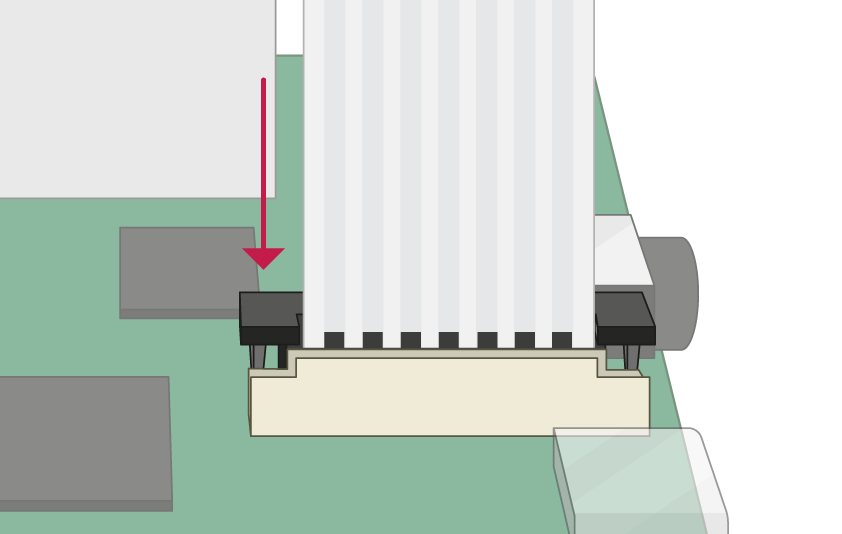

## Connect the Camera Module

**Ensure your Raspberry Pi is turned off.**

--- no-print ---

1. Locate the Camera Module port
2. Gently pull up on the edges of the port's plastic clip
3. Insert the Camera Module ribbon cable; make sure the connectors at the bottom of the ribbon cable are facing the contacts in the port.
4. Push the plastic clip back into place

--- /no-print ---

--- print-only ---

1. Locate the Camera Module port.

2. Gently pull up on the edges of the port's plastic clip.

3. Insert the Camera Module ribbon cable; make sure the connectors at the bottom of the ribbon cable are facing the contacts in the port.

4. Push the plastic clip back into place.

--- /print-only ---

- Reboot your Raspberry Pi.
