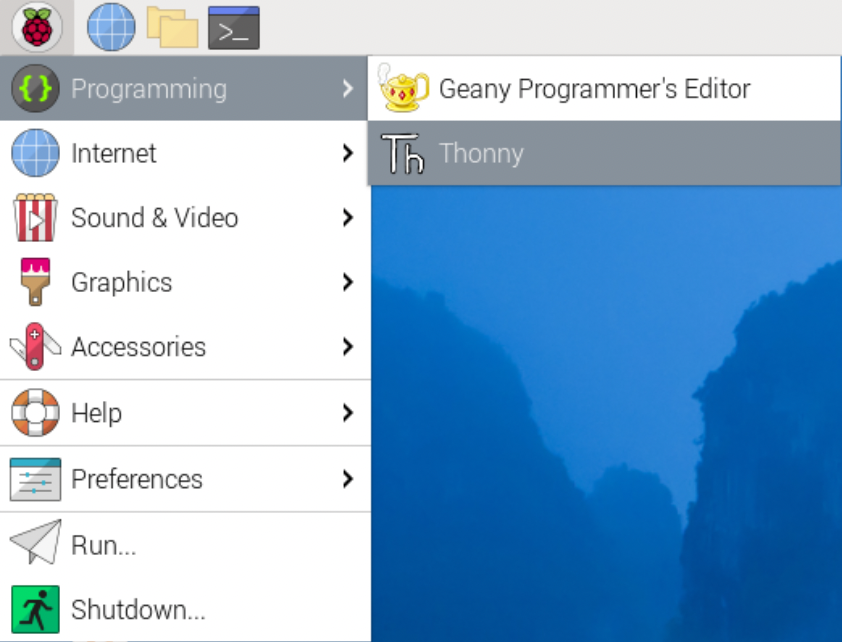

## How to control the Camera Module with Python code

The Python `picamzero` library allows you to control your Camera Module. 

--- task ---
- Open a terminal and type the following commands one at a time to install picamzero:

--- code ---
---
language: linux
line_numbers: false
---
sudo apt update
sudo apt install python3-picamzero
--- /code ---
--- /task ---

--- task ---
- Open a Python 3 editor, such as **Thonny**:

    {:height="100px"}
--- /task ---

--- task ---
- Open a new file and save it to your Desktop as `camera.py`. 

    **Note:** it's important that you **never save the file as `picamzero.py`**.
--- /task ---

--- task ---
- Enter the following code:

--- code ---
---
language: python
line_numbers: true
line_number_start: 1
---

from picamzero import Camera
from time import sleep

cam = Camera()
cam.start_preview()
# Keep the preview window open for 5 seconds
sleep(5)
--- /code ---
--- /task ---

--- task ---
- Save and run your program. The camera preview should be shown for five seconds and then close again. 
--- /task ---

**Note:** the camera preview only works when a monitor is connected to your Raspberry Pi or if you are using remote access (with VNC or Raspberry Pi Connect).

--- task ---
- If you need to rotate your preview and photos, you can use `flip_camera` with the `vflip=True` or horizontal flip: `hflip=True` arguments:

--- code ---
---
language: python
line_numbers: true
line_number_start: 1
line_highlights: 5, 6
---
from picamzero import Camera
from time import sleep

cam = Camera()
cam.flip_camera(hflip=True)
cam.start_preview()
sleep(5)

--- /code ---
--- /task ---


**Tip:** You can combine `hflip` and `vflip` to achieve a 180 degree rotation.

```python
cam.flip_camera(hflip=True, vflip=True)
``` 
