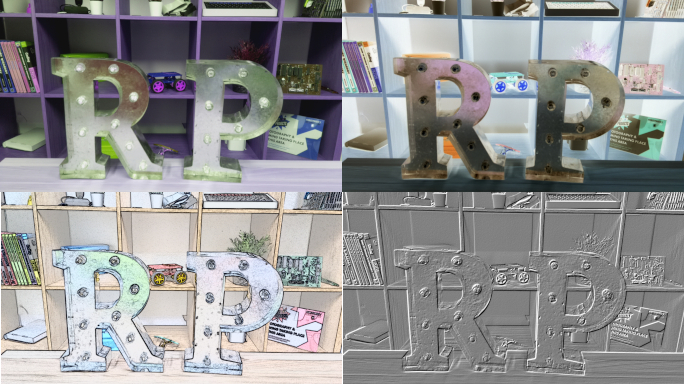

## How to change the image settings and add image effects

The Python `picamera2` library provides a number of effects and configurations to change how your images look.

**Note:** some settings only affect the preview and not the captured image, some affect only the captured image, and many others affect both.

### Set the image resolution

You can change the resolution of the image that the Camera Module takes.

Each Camera Module has different resolution capabilities.

The V1 Module has a maximum resolution of `2592×1944` so we will try that!

- Use the following code to set the resolution to maximum and take a picture.

    ```python
    from picamera2 import Picamera2
    picam2 = Picamera2()
    from time import sleep

    picam2.preview_configuration.size = (2592, 1944)
    picam2.start(show_preview=True)

    sleep(2)

    picam2.capture_file("max.jpg")
    picam2.stop_preview()
    ```

The minimum resolution is `64×64`.

- Try taking a picture with the minimum resolution.

### Set different preview and capture resolutions

- Use the following code to set the preview resolution at a lower resolution to the capture image.

    ```python
    from picamera2 import Picamera2
    picam2 = Picamera2()
    from time import sleep

    picam2.preview_configuration.sensor.output_size = (2592, 1944)
    picam2.preview_configuration.main.size = (800,600)
    picam2.configure("preview")
    picam2.start(show_preview=True)

    sleep(2)

    picam2.capture_file("max.jpg")
    picam2.stop_preview()
    ```

**TODO - LAURA, I'M UP TO HERE**

### Add text to your image

You can add text to your image using the command `annotate_text`.

- Run this code to try it:

    ```python
    picam2.start_preview()
    picam2.annotate_text = "Hello world!"
    sleep(5)
    picam2.capture('/home/pi/Desktop/text.jpg')
    picam2.stop_preview()
    ```

### Change the look of the added text

- Set the text size with the following code:

    ```python
    picam2.annotate_text_size = 50
    ```

    You can set the text size to anything between `6` to `160`. The default size is `32`.

It's also possible to change the text colour.

- First of all, add `Color` to your `import` line at the top of the program:

    ```python
    from picamera import PiCamera, Color
    ```

- Then below the `import` line, amend the rest of your code so it looks like this:

    ```python
    picam2.start_preview()
    picam2.annotate_background = Color('blue')
    picam2.annotate_foreground = Color('yellow')
    picam2.annotate_text = " Hello world "
    sleep(5)
    picam2.stop_preview()
    ```

### Change the brightness of the preview

You can change how bright the preview appears. The default brightness is `50`, and you can set it to any value between `0` and `100`.

* Run the following code to try this out:

    ```python
    picam2.start_preview()
    picam2.brightness = 70
    sleep(5)
    picam2.capture('/home/pi/Desktop/bright.jpg')
    picam2.stop_preview()
    ```

- The following loop adjusts the brightness and also adds text to display the current brightness level:

    ```python
    picam2.start_preview()
    for i in range(100):
        picam2.annotate_text = "Brightness: %s" % i
        picam2.brightness = i
        sleep(0.1)
    picam2.stop_preview()
    ```

### Change the contrast of the preview

Similarly to the preview brightness, you can change the contrast of the preview.

- Run the following code to try this out:

    ```python
    picam2.start_preview()
    for i in range(100):
        picam2.annotate_text = "Contrast: %s" % i
        picam2.contrast = i
        sleep(0.1)
    picam2.stop_preview()
    ```

### Add cool image effects

You can use `picam2.image_effect` to apply a particular image effect. 

The image effect options are:

* `none`
* `negative`
* `solarize`
* `sketch`
* `denoise`
* `emboss`
* `oilpaint`
* `hatch`
* `gpen`
* `pastel`
* `watercolor`
* `film`
* `blur`
* `saturation`
* `colorswap`
* `washedout`
* `posterise`
* `colorpoint`
* `colorbalance`
* `cartoon`
* `deinterlace1`
* `deinterlace2`

The default effect is `none`. 
    
* Pick an image effect and try it out:

    ```python
    picam2.start_preview()
    picam2.image_effect = 'colorswap'
    sleep(5)
    picam2.capture('/home/pi/Desktop/colorswap.jpg')
    picam2.stop_preview()
    ```

* Run this code to loop over **all** the image effects with `picam2.IMAGE_EFFECTS`:

    ```python
    picam2.start_preview()
    for effect in picam2.IMAGE_EFFECTS:
        picam2.image_effect = effect
        picam2.annotate_text = "Effect: %s" % effect
        sleep(5)
    picam2.stop_preview()
    ```

    

### Set the image exposure mode

You can use `picam2.exposure_mode` to set the exposure to a particular mode. 

The exposure mode options are:
* `off`
* `auto`
* `night`
* `nightpreview`
* `backlight`
* `spotlight`
* `sports`
* `snow`
* `beach`
* `verylong`
* `fixedfps`
* `antishake`
* `fireworks`

The default mode is `auto`.
    
* Pick an exposure mode and try it out:

    ```python
    picam2.start_preview()
    picam2.exposure_mode = 'beach'
    sleep(5)
    picam2.capture('/home/pi/Desktop/beach.jpg')
    picam2.stop_preview()
    ```

* You can loop over all the exposure modes with `picam2.EXPOSURE_MODES`, like you did for the image effects.

### Change the image white balance

You can use `picam2.awb_mode` to set the auto white balance to a preset mode. 

The available auto white balance modes are:
* `off`
* `auto`
* `sunlight`
* `cloudy`
* `shade`
* `tungsten`
* `fluorescent`
* `incandescent`
* `flash`
* `horizon`

The default is `auto`. 
    
* Pick an auto white balance mode and try it out:

    ```python
    picam2.start_preview()
    picam2.awb_mode = 'sunlight'
    sleep(5)
    picam2.capture('/home/pi/Desktop/sunlight.jpg')
    picam2.stop_preview()
    ```

* You can loop over all the auto white balance modes with `picam2.AWB_MODES`, like you did for the image effects.