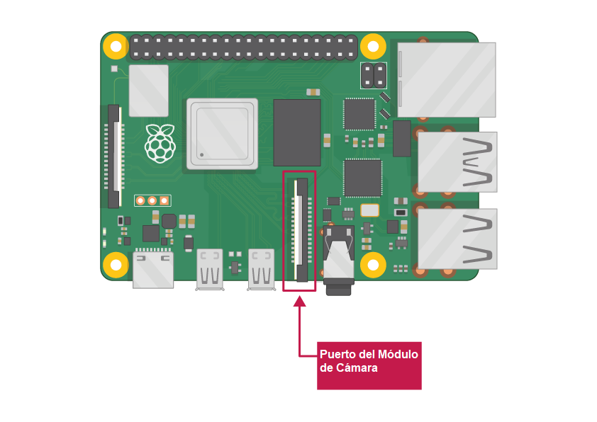

## Lo que necesitarás

### Computadora Raspberry Pi con un puerto para el Módulo de Cámara

Todos los modelos actuales de Raspberry Pi tienen un puerto para conectar el Módulo de Cámara.

**Nota:** Si quieres utilizar un Raspberry Pi Zero, necesitas un cable plano para Módulo de Cámara que encaje en el puerto más pequeño del Módulo de Cámara de Raspberry Pi Zero.

### Módulo de Cámara de Raspberry Pi

Hay dos versiones del Módulo de Cámara:

* [La versión estándar](https://www.raspberrypi.org/products/camera-module-v2/), que está diseñada para tomar fotos con luz normal
* [La versión NoIR](https://www.raspberrypi.org/products/pi-noir-camera-v2/), que no tiene un filtro infrarrojo, por lo que puedes utilizarlo junto con una fuente de luz infrarroja para tomar fotos en la oscuridad

