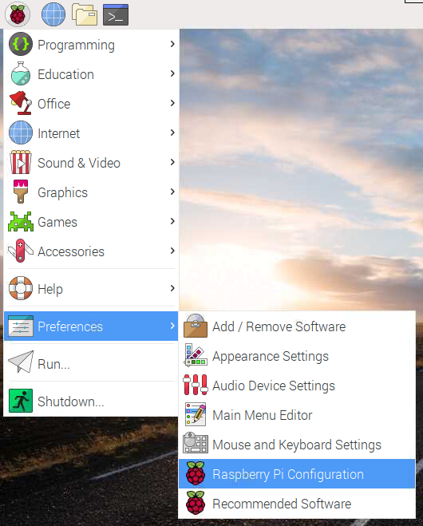

## Conecta el Módulo de la Cámara

**Asegúrate de que tu Raspberry Pi esté apagada.**

--- no-print ---

1. Localiza el puerto del Módulo de Cámara
2. Tira suavemente hacia arriba los bordes del clip de plástico del puerto
3. Inserta el cable plano del Módulo de Cámara; asegúrate de que el cable esté en la posición correcta
4. Vuelve a colocar el clip de plástico en su lugar

--- /no-print ---

--- print-only ---

1. Localiza el puerto del Módulo de Cámara.

2. Tira suavemente hacia arriba los bordes del clip de plástico del puerto.

3. Inserta el cable plano del Módulo de Cámara; asegúrate de que el cable esté en la posición correcta.

4. Vuelve a colocar el clip de plástico en su lugar.

--- /print-only ---

- Inicia tu Raspberry Pi.

- Ve al menú principal y abre la herramienta de **Configuración de Raspberry Pi **.

    

- Selecciona la pestaña **Interfaces** y asegúrate de que la cámara esté **habilitada**:

    

- Reinicia tu Raspberry Pi.
