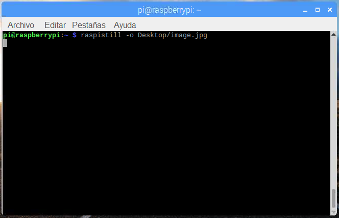
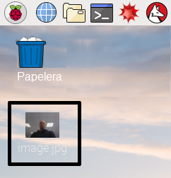

## Cómo controlar la Cámara de Módulo a través de la línea de comandos

Ahora que el Módulo de Cámara está conectado y el software está habilitado, prueba las herramientas de líneas de comando `raspistill` y `raspivid`.

- Abre una ventana de terminal haciendo clic en el ícono del monitor negro en la barra de tareas:


- Escribe el siguiente comando para tomar una imagen fija y guardarla en el Escritorio:

```bash
raspistill -o Desktop/image.jpg
```



- Presiona <kbd>Enter</kbd> para ejecutar el comando.

Cuando se ejecute el comando, puedes ver la vista previa de la cámara abierta durante cinco segundos antes de que se tome una imagen fija.

- Busca el ícono del archivo de imagen en el Escritorio y haz doble clic en el ícono de archivo para abrir la foto.

    

Al agregar diferentes opciones, puedes establecer el tamaño y la apariencia de la imagen que genera el comando `raspistill`.

- Por ejemplo, agrega `-h` y `-w` para cambiar la altura y el ancho de la imagen:

```bash
raspistill -o Desktop/image-small.jpg -w 640 -h 480
```

- Ahora graba un video con el Módulo de Cámara usando el siguiente comando `raspivid`:

```bash
raspivid -o Desktop/video.h264
```

- In order to play the video file, double-click the `video.h264` file icon on the Desktop to open it in VLC Media Player.

For more information and other options you can use with these commands, read the [documentation for raspistill](https://www.raspberrypi.org/documentation/usage/camera/raspicam/raspistill.md) and the [documentation for raspivid](https://www.raspberrypi.org/documentation/usage/camera/raspicam/raspivid.md).
