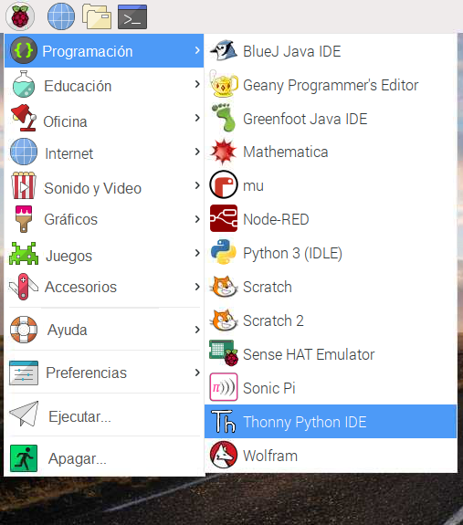

## Cómo controlar el Módulo de Cámara con código Python

La biblioteca Python `picamera` te permite controlar tu Módulo de Cámara y crear proyectos increíbles.

- Abre un editor Python 3, como **Thonny Python IDE**:

    

- Abre un nuevo archivo y guárdalo como `camera.py`.

    **Nota:** es importante que **nunca guardes el archivo como `picamera.py`**.

- Escribe el siguiente código:

    ```python
    from picamera import PiCamera
    from time import sleep

    camera = PiCamera()

    camera.start_preview()
    sleep(5)
    camera.stop_preview()
    ```

- Guarda y ejecuta tu programa. La vista previa de la cámara debería mostrarse durante cinco segundos y luego cerrarse nuevamente.

    

    **Nota:** la vista previa de la cámara solo funciona cuando el monitor está conectado a tu Raspberry Pi. Si estás usando acceso remoto (como SSH o VNC) no verás la vista previa de la cámara.

- Si tu vista previa está al revés, puedes girarla 180 grados con el siguiente código:

    ```python
    camera = PiCamera()
    camera.rotation = 180
    ```

    Puedes girar la imagen `90`, `180`, o `270` grados. Para restablecer la imagen, configura la `rotación` a `0` grados.

Es mejor hacer que la vista previa sea un poco transparente para que puedas ver si ocurren errores en tu programa mientras la vista previa esté activa.

- Haz que la vista previa de la cámara sea transparente configurando un nivel `alpha`:

    ```python
    camera.start_preview(alpha=200)
    ```

    El valor `alpha` puede ser cualquier número entre `0` y `255`.