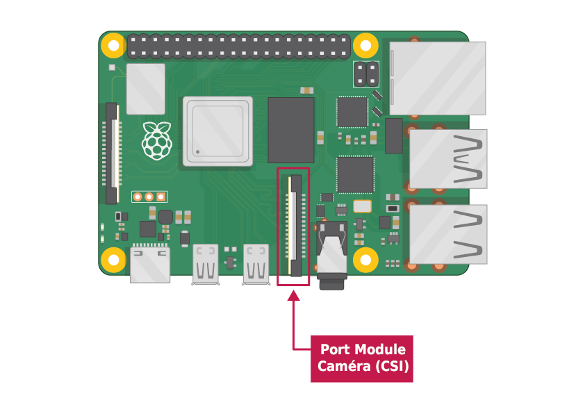

## Ce dont tu auras besoin

### Un ordinateur Raspberry Pi avec un port module caméra

Tous les modèles actuels du Raspberry Pi ont un port pour connecter le module caméra.

**Remarque :** Si tu veux utiliser un Raspberry Pi Zero, tu as besoin d'une nappe caméra qui s'adapte au plus petit port du module caméra du Raspberry Pi Zero.

### Module caméra du Raspberry Pi

Il existe deux versions du module caméra :

* [La version standard](https://www.raspberrypi.org/products/camera-module-v2/), conçue pour prendre des photos en lumière normale
* [La version NoIR](https://www.raspberrypi.org/products/pi-noir-camera-v2/), qui n'a pas de filtre infrarouge, tu peux donc l'utiliser avec une source de lumière infrarouge pour prendre des photos dans l'obscurité

