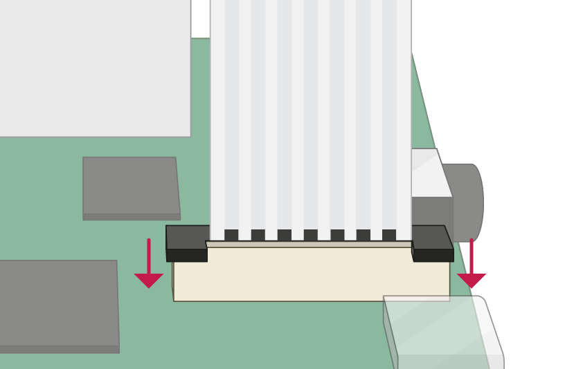
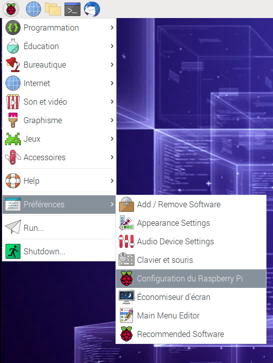
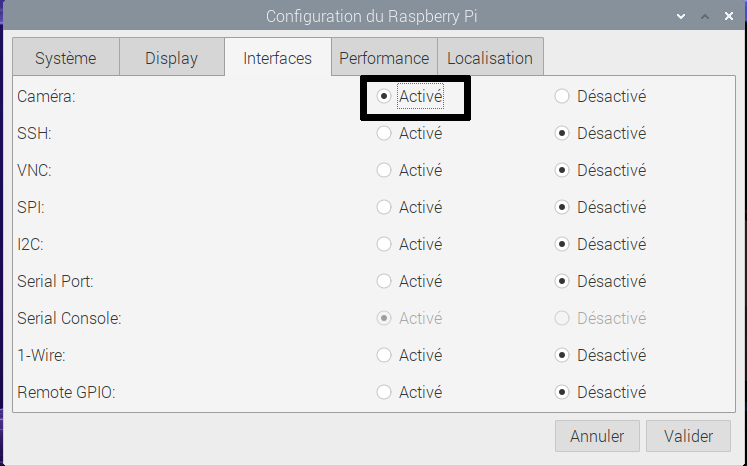

## Connecter le module caméra

**Assure-toi que ton Raspberry Pi est éteint.**

--- no-print ---

1. Trouve le port du module caméra
2. Tire doucement sur les bords du clip en plastique du port
3. Insère la nappe caméra ; assure-toi que la nappe est dans le bon sens
4. Remets le clip en plastique en place

--- /no-print ---

--- print-only ---

1. Trouve le port du module caméra.

2. Tire doucement sur les bords du clip en plastique du port.

3. Insère la nappe caméra ; assure-toi que la nappe est dans le bon sens.

4. Remets le clip en plastique en place.

--- /print-only ---

- Démarre ton Raspberry Pi.

- Va dans le menu principal et ouvre l'outil **Configuration du Raspberry Pi**.

    

- Sélectionne l'onglet **Interfaces** et assure-toi que la caméra est **activée** :

    

- Redémarre ton Raspberry Pi.
