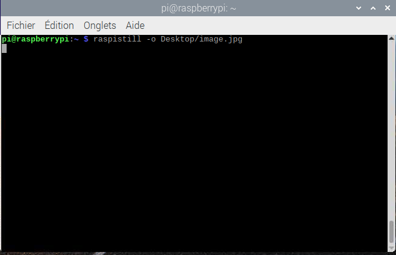
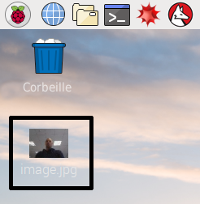

## Comment contrôler le module caméra via la ligne de commande

Maintenant que ton module caméra est connecté et que le logiciel est activé, essaie les outils de ligne de commande `raspistill` et `raspivid`.

- Ouvre une fenêtre de terminal en cliquant sur l'icône du moniteur noir dans la barre des tâches :


- Saisis la commande suivante pour capturer une image fixe et l'enregistrer sur le bureau :

```bash
raspistill -o Desktop/image.jpg
```



- Appuie sur <kbd>Entrée</kbd> pour exécuter la commande.

Lorsque la commande s'exécute, tu peux voir l'aperçu de la caméra s'ouvrir pendant cinq secondes avant qu'une image fixe ne soit capturée.

- Recherche l'icône du fichier image sur le bureau et double-clique sur l'icône du fichier pour ouvrir l'image.

    

En ajoutant différentes options, tu peux définir la taille et l'apparence de l'image que prend la commande `raspistill`.

- Par exemple, ajoute `-h` et `-w` pour modifier la hauteur et la largeur de l'image :

```bash
raspistill -o Desktop/image-small.jpg -w 640 -h 480
```

- Enregistre maintenant une vidéo avec le module caméra en utilisant la commande `raspivid` :

```bash
raspivid -o Desktop/video.h264
```

- Pour lire le fichier vidéo, double-clique sur l'icône du fichier `video.h264` sur le bureau pour l'ouvrir dans VLC Media Player.

Pour plus d'informations et d'autres options que tu peux utiliser avec ces commandes, lis la documentation pour [raspistill](https://www.raspberrypi.org/documentation/usage/camera/raspicam/raspistill.md) et la [documentation pour raspivid](https://www.raspberrypi.org/documentation/usage/camera/raspicam/raspivid.md).
