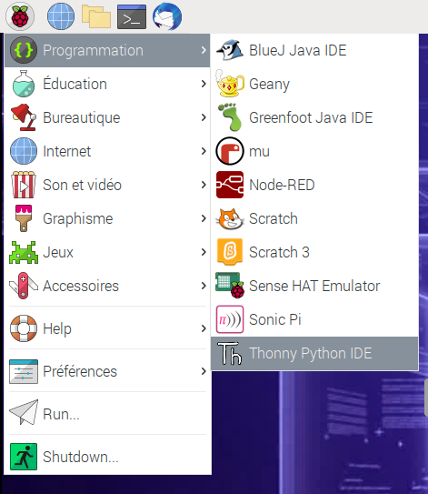

## Comment contrôler le module caméra avec du code Python

La bibliothèque Python `picamera` te permet de contrôler ton module caméra et de créer des projets incroyables.

- Ouvre un éditeur Python 3, tel que **Thonny Python IDE** :

    

- Ouvre un nouveau fichier et enregistre-le sous `camera.py`.

    **Remarque :** il est important que tu **ne sauvegardes jamais le fichier en tant que `picamera.py`**.

- Entre le code suivant :

    ```python
    from picamera import PiCamera
    from time import sleep

    camera = PiCamera()

    camera.start_preview()
    sleep(5)
    camera.stop_preview()
    ```

- Enregistre et teste ton programme. L'aperçu de la caméra devrait s'afficher pendant cinq secondes, puis se refermer.

    

    **Remarque :** l'aperçu de la caméra ne fonctionne que lorsqu'un moniteur est connecté à ton Raspberry Pi. Si tu utilises un accès à distance (tel que SSH ou VNC), tu ne verras pas l'aperçu de la caméra.

- Si ton aperçu est à l'envers, tu peux le faire pivoter de 180 degrés avec le code suivant :

    ```python
    camera = PiCamera()
    camera.rotation = 180
    ```

    Tu peux faire pivoter l'image de `90`, `180` ou `270` degrés. Pour réinitialiser l'image, définis la `rotation` sur `0` degrés.

Il est préférable de rendre l'aperçu légèrement transparent afin de voir si des erreurs se produisent dans ton programme lorsque l'aperçu est activé.

- Rendre l'aperçu de la caméra transparent en définissant un niveau `alpha` :

    ```python
    camera.start_preview(alpha=200)
    ```

    La valeur `alpha` peut être n'importe quel nombre compris entre `0` et `255`.