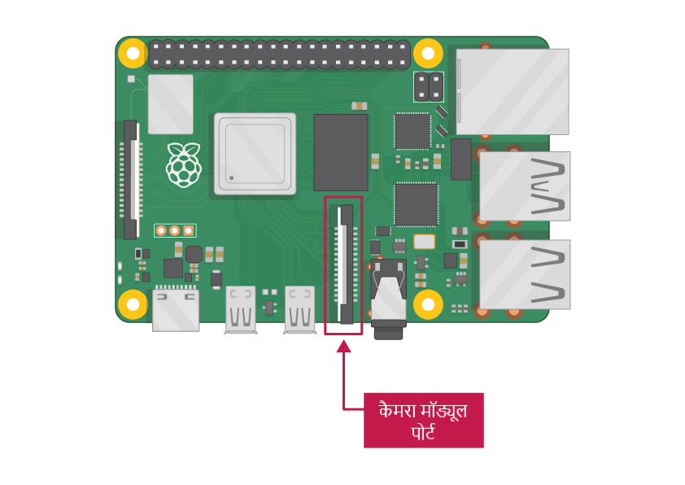

## आपको किन चीज़ों की आवश्यकता होगी

### कैमरा मॉड्यूल पोर्ट के साथ Raspberry Pi कंप्यूटर

Raspberry Pi के सभी मौजूदा मॉडल में कैमरा मॉड्यूल को जोड़ने के लिए एक पोर्ट है।

**ध्यान दें:** यदि आप Raspberry Pi Zero का उपयोग करना चाहते हैं, तो आपको एक कैमरा मॉड्यूल रिबन केबल की आवश्यकता होती है जो Raspberry Pi Zero के छोटे कैमरा मॉड्यूल पोर्ट में फिट आता है।

### Raspberry Pi कैमरा मॉड्यूल

कैमरा मॉड्यूल के दो संस्करण हैं:

* [Standard संस्करण](https://www.raspberrypi.org/products/camera-module-v2/), जिसे सामान्य प्रकाश में चित्र लेने के लिए डिज़ाइन किया गया है
* [NoIR version](https://www.raspberrypi.org/products/pi-noir-camera-v2/), जिसमें इन्फ्रारेड फ़िल्टर नहीं है, इसलिए आप इसे अंधेरे में तस्वीरें लेने के लिए एक इन्फ्रारेड प्रकाश स्रोत के साथ मिलकर इस्तेमाल कर सकते हैं

