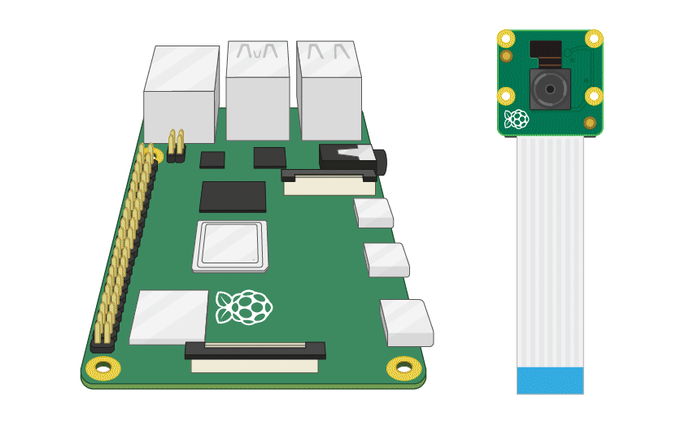

## カメラモジュールを接続する

**Raspberry Piがオフになっていることを確認してください。**

--- no-print ---

1. カメラモジュールポートを見つけます
2. ポートのプラスチッククリップの端（はし）をそっと引き上げます
3. カメラモジュールのリボンケーブルを差しこみます。ケーブルが正しい方向にあることを確認してください
4. プラスチッククリップを元の位置にもどします

--- /no-print ---

--- print-only ---

1. カメラモジュールポートを見つけます。

2. ポートのプラスチッククリップの端（はし）をそっと引き上げます。

3. カメラモジュールのリボンケーブルを差しこみます。ケーブルが正しい方向にあることを確認してください。

4. プラスチッククリップを元の位置にもどします。

--- /print-only ---

- Raspberry Piを起動します。

- メインメニューに移動し、 **Raspberry Pi Configuration** (設定)ツールを開きます。

    

- **Interfaces** (インターフェイス)タブを選択し、カメラが**enabled**(有効)になっていることを確認します

    

- Raspberry Piを再起動します。
