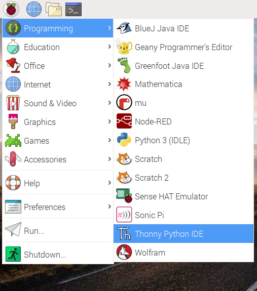

## Pythonコードでカメラモジュールをコントロールする方法

Python `picamera` ライブラリを使用すると、カメラモジュールをコントロールして素晴らしいプロジェクトを作成できます。

- **Thonny Python IDE** など、Python 3 エディタを開きます。

    

- 新しいファイルを開き、 `camera.py` として保存します。

    **注意:** **ファイルを`picamera.py `として保存しない** ことが重要です。

- 次のコードを入力します。

    ```python
    from picamera import PiCamera
    from time import sleep

    camera = PiCamera()

    camera.start_preview()
    sleep(5)
    camera.stop_preview()
    ```

- プログラムを保存して実行します。 カメラのプレビューが5秒間表示され、再び閉じます。

    

    **注意:** カメラのプレビューは、モニターがRaspberry Piに接続されている場合にのみ機能します。 リモートアクセス（SSHやVNCなど）を使用している場合、カメラのプレビューは表示されません。

- プレビューが上下逆になっている場合は、次のコードを使用してプレビューを180度回転させることができます。

    ```python
    camera = PiCamera()
    camera.rotation = 180
    ```

    画像を `90`、 `180`、または `270` 度回転させることができます。 画像をリセットするには、 `rotation` (回転)を `0` 度に設定します。

プレビューがオンのときにプログラムでエラーが発生するかどうかを確認できるように、プレビューを少し透（す）けて見えるようにすることをお勧（すす）めします。

- `alpha` レベルを設定して、カメラプレビューを透かします。

    ```python
    camera.start_preview(alpha=200)
    ```

    `alpha` の値は `0` から `255` の間の任意の数値にできます。