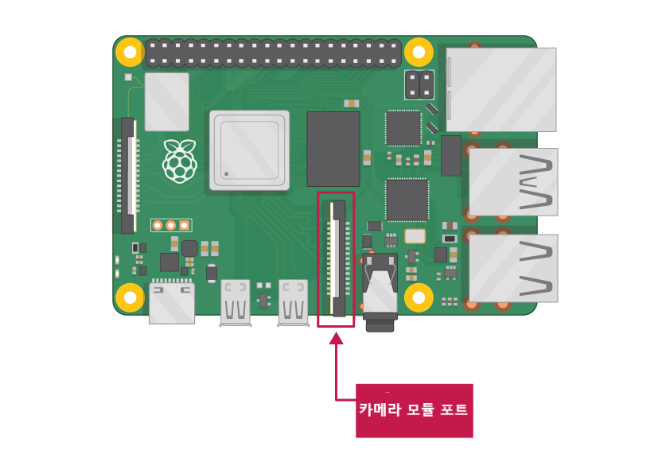

## 준비물

### 카메라 모듈 포트가 있는 Raspberry Pi

현재 모든 Raspberry Pi 모델에는 카메라 모듈을 연결하는 포트가 있습니다.

**주의:** Raspberry Pi Zero를 사용하고 싶다면 Raspberry Pi Zero의 작은 카메라 모듈 포트에 맞는 카메라 모듈 리본 케이블이 필요합니다.

### Raspberry Pi 카메라 모듈

카메라 모듈에는 두 버전이 있습니다:

* [standard 버전](https://www.raspberrypi.org/products/camera-module-v2/), 이것은 일반 조명에서 찍기 위해 설계되었습니다.
* [NoIR 버전](https://www.raspberrypi.org/products/pi-noir-camera-v2/), 이것은 적외선 필터가 없어서 적외선 광원과 함께 사용하여 어두운 곳에서 사진을 찍을 수 있습니다.

