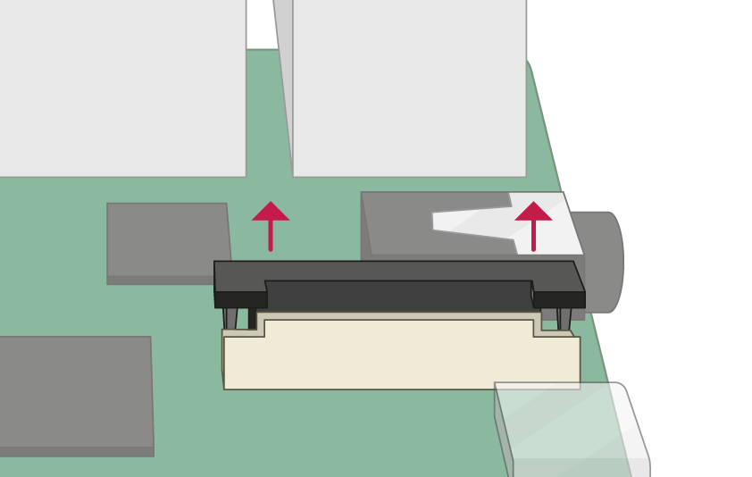
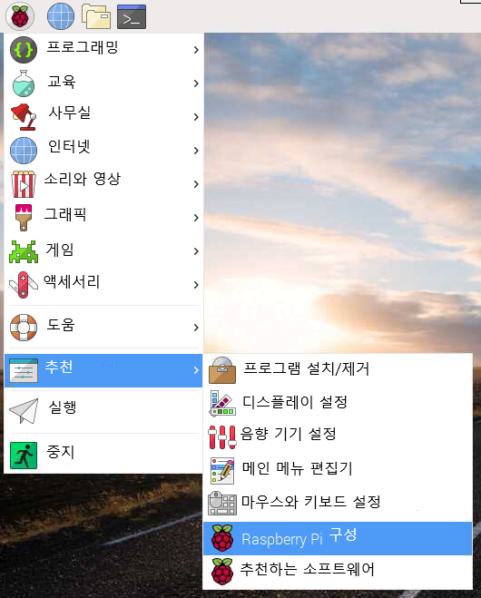
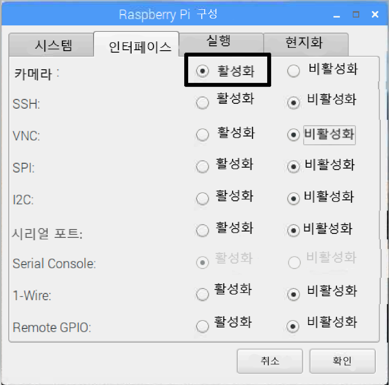

## 카메라 모듈 연결하기

**Raspberry Pi가 꺼졌는지 확인합니다.**

--- no-print ---

1. 카메라 모듈 포트를 찾습니다.
2. 포트의 플라스틱 클립 모서리를 부드럽게 위로 당깁니다.
3. Insert the Camera Module ribbon cable; make sure the connectors at the bottom of the ribbon cable are facing the contacts in the port.
4. 플라스틱 클립을 다시 제자리에 넣습니다.

--- /no-print ---

--- print-only ---

1. 카메라 모듈 포트를 찾습니다.

2. 포트의 플라스틱 클립 모서리를 부드럽게 위로 당깁니다.

3. Insert the Camera Module ribbon cable; make sure the connectors at the bottom of the ribbon cable are facing the contacts in the port.

4. 플라스틱 클립을 다시 제자리에 넣습니다.

--- /print-only ---

- Raspberry Pi 시작하기.

- 메인 메뉴에 가서 **Raspberry Pi 구성** 도구를 엽니다.

    

- **Interface** 탭을 선택하고 카메라가 **활성화** 되어 있는지 확인합니다.

    

- Raspberry Pi를 다시 시작합니다.
