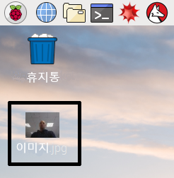

## 명령 줄을 통해 카메라 모듈을 제어하는 방법

이제 카메라 모듈이 연결되었고 소프트웨어가 활성화 되었습니다. 명령 줄 도구에서 `raspistill`과 `raspivid`를 시도합니다.

- 작업 표시줄에서 검은 모니터 아이콘을 클릭해서 터미널 창을 엽니다.


- 다음 명령을 입력하여 스틸 사진을 찍고 바탕 화면에 저장합니다.

```bash
raspistill -o Desktop/image.jpg
```


- <kbd>엔터</kbd>를 누르고 명령을 실행합니다.

명령이 작동하면 스틸 사진이 찍히기 전에 카메라 미리보기를 5초 동안 볼 수 있습니다.

- 바탕 화면에서 사진 파일 아이콘을 찾아 더블 클릭해서 사진을 엽니다.

    

`raspistill` 명령어에 다른 옵션을 추가함으로써, 크기와 사진 형태를 설정할 수 있습니다.

- 예를 들어, 높이와 너비를 바꾸려면 `-h`와 `-w`를 추가하세요.

```bash
raspistill -o Desktop/image-small.jpg -w 640 -h 480
```

- 이제 다음의 `raspivid` 명령을 사용하여 카메라 모듈로 영상을 녹화합니다.

```bash
raspivid -o Desktop/video.h264
```

- 영상 파일을 재생하기 위해서 바탕 화면에 있는 `video.h264` 파일 아이콘을 더블 클릭하여 VLC Media Player에서 엽니다.

당신이 사용할 수 있는 더 많은 정보와 다른 옵션을 보려면 [raspisill를 위한 문서](https://www.raspberrypi.org/documentation/usage/camera/raspicam/raspistill.md)와 [raspivid를 위한 문서](https://www.raspberrypi.org/documentation/usage/camera/raspicam/raspivid.md) 명령을 이용할 수 있습니다.
