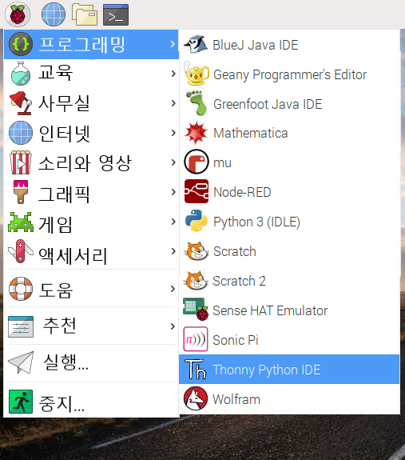

## Python 코드를 통해 카메라 모듈을 제어하는 방법

Python `picamera` 라이브러리로 당신은 카메라 모듈을 조절하고 엄청난 프로젝트를 만들 수 있습니다.

- **Thonny Python IDE**와 같은 Python 3 편집기를 엽니다:

    

- 새로운 파일을 열어 `camera.py`로 저장합니다.

    **주의:** **절대 파일을 `picamera.py`**로 저장하지 말아야 합니다!

- 다음 코드를 추가하세요:

    ```python
    from picamera import PiCamera
    from time import sleep

    camera = PiCamera()

    camera.start_preview()
    sleep(5)
    camera.stop_preview()
    ```

- 프로그램을 저장하고 실행합니다. 카메라 미리보기는 5초 동안 보이고 다시 닫혀야 합니다.

    

    **주의:** 카메라 미리보기는 모니터가 Raspberry Pi와 연결되었을 때만 작동합니다. 원격 접속 프로그램(SSH나 VNC 같은) 을 이용하고 있다면 카메라 미리보기가 안 보입니다.

- 미리보기가 위 아래로 뒤집어져 있다면 다음 코드로 180도 회전시킵니다.

    ```python
    camera = PiCamera()
    camera.rotation = 180
    ```

    `90`, `180`, 이나 `270`도로 사진을 회전할 수 있습니다. 이미지를 다시 설정하려면 `rotation`(회전) 을 `0`도로 바꿉니다.

미리보기가 실행되는 동안 프로그램에서 에러가 발생하는지 보기 위해서 미리보기를 살짝 비쳐보이게 하는 것이 가장 좋습니다.

- `alpha` 수준을 설정해서 카메라 미리보기가 비쳐보이게 만듭니다.

    ```python
    amera.start_preview(alpha=200)
    ```

    `alpha` 값은 `0`과 `255`사이의 아무 숫자가 될 수 있습니다.