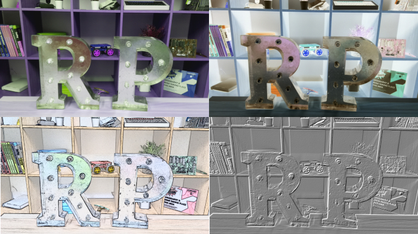

## 이미지 설정을 변경하고 이미지 효과를 추가하는 방법

Python `picamera` 라이브러리는 이미지를 바꾸는 많은 효과와 구성을 제공합니다.

**주의:** 몇몇 환경설정은 찍힌 사진이 아니라 미리보기에만 영향을 미칩니다. 몇몇 은 찍힌 사진과 많은 다른 것들 모두에 영향을 미칩니다.

### 이미지 해상도를 설정하기

카메라 모듈이 찍는 사진의 `resolution`(해상도) 를 바꿀 수 있습니다.

기본값으로 이미지 해상도는 당신의 모니터 해상도로 설정되어 있습니다. 스틸 사진의 최대 해상도는 2592×1944이고 영상 녹화는 1920×1080입니다.

- `resolution`를 최대로 설정하고 사진을 찍기 위해 다음의 코드를 사용하세요.

    **주의:** 최대 해상도를 사용가능하게 하려면 프레임 속도를 `15`로 설정해야 합니다.

    ```python
    camera.resolution = (2592, 1944)
    camera.framerate = 15
    camera.start_preview()
    sleep(5)
    camera.capture('/home/pi/Desktop/max.jpg')
    camera.stop_preview()
    ```

최소 해상도는 64×64 입니다.

- 최소 해상도로 사진을 찍어보세요.

### 이미지에 글 추가하기

명령 `annotate_text`을 이용해서 이미지에 글을 추가할 수 있습니다.

- 이 코드를 실행하여 시도해 보세요:

    ```python
    camera.start_preview()
    camera.annotate_text = "Hello world!"
    sleep(5)
    camera.capture('/home/pi/Desktop/text.jpg')
    camera.stop_preview()
    ```

### 추가된 글의 모양을 변경하기

- 다음의 코드로 글자의 크기를 설정하세요:

    ```python
    camera.annotate_text_size = 50
    ```

    `6`에서 `160`까지의 아무 크기로 글자 크기를 설정할 수 있습니다. 기본값은 `32` 입니다.

글자 색깔을 바꾸는 것도 가능합니다.

- 먼저, `Color`을 프로그램 맨 위에 있는 `import`에 추가하세요.

    ```python
    from picamera import PiCamera, Color
    ```

- 그런 다음 `import` 줄 아래에서 나머지 코드를 다음과 같이 수정합니다.

    ```python
    camera.start_preview()
    camera.annotate_background = Color('blue')
    camera.annotate_foreground = Color('yellow')
    camera.annotate_text = " Hello world "
    sleep(5)
    camera.stop_preview()
    ```

### 미리보기의 밝기 변경

미리보기의 밝기를 변경할 수 있습니다. 기본 밝기는 `50`이고 `0` 에서 `100`사이의 값으로 설정할 수 있습니다.

* 이것을 시도하려면 다음 코드를 실행하세요:

    ```python
    camera.start_preview()
    camera.brightness = 70
    sleep(5)
    camera.capture('/home/pi/Desktop/bright.jpg')
    camera.stop_preview()
    ```

- 다음 루프는 밝기를 조정하고 텍스트를 추가하여 현재 밝기 수준을 표시합니다.

    ```python
    camera.start_preview()
    for i in range(100):
        camera.annotate_text = "Brightness: %s" % i
        camera.brightness = i
        sleep(0.1)
    camera.stop_preview()
    ```

### 미리보기의 대비 변경

미리보기 밝기와 마찬가지로 미리보기의 대비를 변경할 수 있습니다.

- 이것을 시도하려면 다음 코드를 실행하세요:

    ```python
    camera.start_preview()
    for i in range(100):
        camera.annotate_text = "Contrast: %s" % i
        camera.contrast = i
        sleep(0.1)
    camera.stop_preview()
    ```

### 멋진 이미지 효과 추가

`camera.image_effect` 을 사용하여 특정 이미지 효과를 적용할 수 있습니다.

이미지 효과 옵션은 다음과 같습니다:

* `none`
* `negative`
* `solarize`
* `sketch`
* `denoise`
* `emboss`
* `oilpaint`
* `hatch`
* `gpen`
* `pastel`
* `watercolor`
* `film`
* `blur`
* `saturation`
* `colorswap`
* `washedout`
* `posterise`
* `colorpoint`
* `colorbalance`
* `cartoon`
* `deinterlace1`
* `deinterlace2`

기본값은 `none` 입니다.

* 이미지 효과를 선택하고 사용해보세요:

    ```python
    camera.start_preview()
    camera.image_effect = 'colorswap'
    sleep(5)
    camera.capture('/home/pi/Desktop/colorswap.jpg')
    camera.stop_preview()
    ```

* **모든** 이미지에 `camera.IMAGE_EFFECTS` 효과를 반복하기 위해서 이 코드를 실행하세요:

    ```python
    camera.start_preview()
    for effect in camera.IMAGE_EFFECTS:
        camera.image_effect = effect
        camera.annotate_text = "Effect: %s" % effect
        sleep(5)
    camera.stop_preview()
    ```

    

### 이미지 노출 모드 설정

`camera.exposure_mode`를 사용하여 특정 모드에 대한 노출을 설정할 수 있습니다.

다음의 옵션들을 사용할 수 있습니다:
* `off`
* `auto`
* `night`
* `nightpreview`
* `backlight`
* `spotlight`
* `sports`
* `snow`
* `beach`
* `verylong`
* `fixedfps`
* `antishake`
* `fireworks`

기본 모드는 `auto` 입니다.

* 노출 모드를 선택하고 시도해 보세요:

    ```python
    camera.start_preview()
    camera.exposure_mode = 'beach'
    sleep(5)
    camera.capture('/home/pi/Desktop/beach.jpg')
    camera.stop_preview()
    ```

* 이미지 효과에서 했던 것 처럼 전반적인 노출 모드를 `camera.EXPOSURE_MODES`로 반복할 수 있습니다.

### 이미지 화이트 밸런스 변경

`camera.awb_mode`를 사용하여 자동 화이트 밸런스를 사전 설정 모드로 설정할 수 있습니다.

사용 가능한 자동 화이트 밸런스 모드는 다음과 같습니다:
* `off`
* `auto`
* `sunlight`
* `cloudy`
* `shade`
* `tungsten`
* `fluorescent`
* `incandescent`
* `flash`
* `horizon`

기본값은 `auto`입니다.

* 자동 화이트 밸런스 모드를 선택하고 사용해 보세요:

    ```python
    camera.start_preview()
    camera.awb_mode = 'sunlight'
    sleep(5)
    camera.capture('/home/pi/Desktop/sunlight.jpg')
    camera.stop_preview()
    ```

* 이미지 효과에서 했던 것 처럼 전반적인 화이트 밸런스 모드를 `camera.AWB_MODES`로 반복 할 수 있습니다.