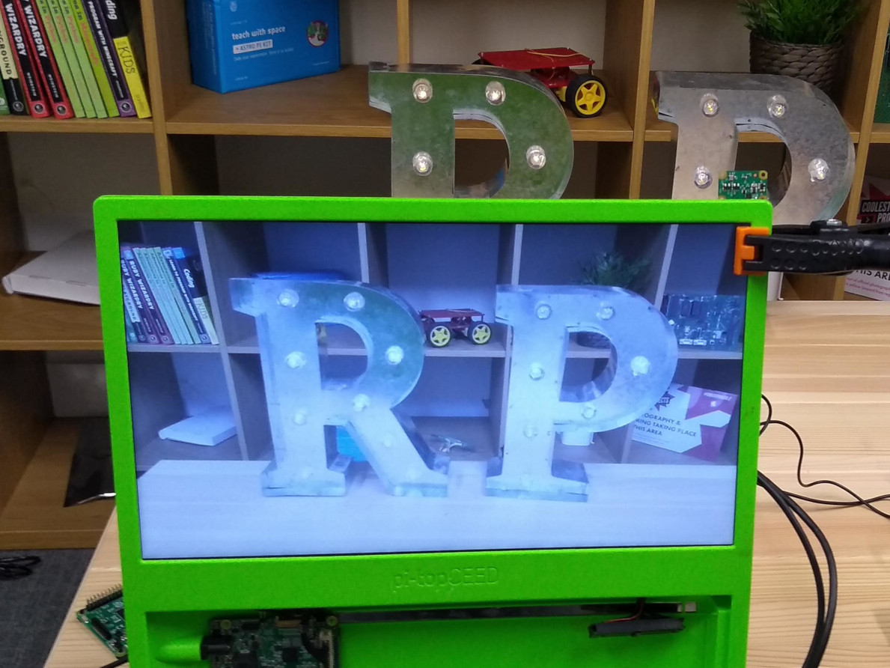

## पायथन कोडसह कॅमेरा मॉड्यूल कसे नियंत्रित करावे

पायथन `पाईकॅमेरा` लायब्ररी आपल्याला आपला कॅमेरा मॉड्यूल नियंत्रित करण्यास आणि आश्चर्यकारक प्रोजेक्ट्स तयार करण्यास परवानगी देते.

- पायथन 3 एडिटर उघडा, जसे **Thonny Python IDE**:

    

- एक नवीन फाईल उघडा आणि त्यास `camera.py` म्हणून सेव्ह करा.

    **टीप:** हे महत्वाचे आहे की आपण **कधीही ` picamera.py <`** म्हणून फाइल सेव्ह करू नका.

- खालील कोड एंटर करा:

    ```python
    from picamera import Picamera
    from time import sleep

    camera = Picamera ()

     camera.start_preview()
     sleep (5)
     camera.stop_preview()
    ```

- आपला प्रोग्राम सेव्ह करा आणि चालवा. कॅमेरा प्रिव्यू पाच सेकंदासाठी दाखवावा आणि नंतर पुन्हा बंद करावा.

    

    **टीप:** जेव्हा मॉनिटर आपल्या रास्पबेरी पाईला कनेक्ट केलेला असेल तेव्हाच कॅमेरा प्रिव्यू काम करते. आपण रिमोट ऍक्सेस वापरत असल्यास(जसे की SSH किंवा VNC), आपण 'कॅमेरा प्रिव्यू पाहू शकणार नाही.

- जर आपले प्रिव्यू उलट असेल तर आपण खालील कोडसह 180 डिग्री तो फिरवू शकता:

    ```python
    camera = PiCamera()
     camera. rotation = 180
    ```

    आपण चित्र `90`, `180`, किंवा `270` डिग्रीमध्ये फिरवू शकता. चित्र रीसेट करण्यासाठी `rotation` `0` डिग्रीमध्ये सेट करा.

प्रिव्यू किंचित पाहणे चांगले आहे जेणेकरून प्रिव्यू चालू असताना आपल्या प्रोग्राममध्ये चुका आढळतात की नाही ते आपण पाहू शकता.

- `alpha` पातळी सेट करुन कॅमेरा प्रिव्यू बनवा:

    ```python
    camera.start_preview(alpha=200)
    ```

    `अल्फा` मूल्य `0` आणि `255` दरम्यान कोणतीही संख्या असू शकते.