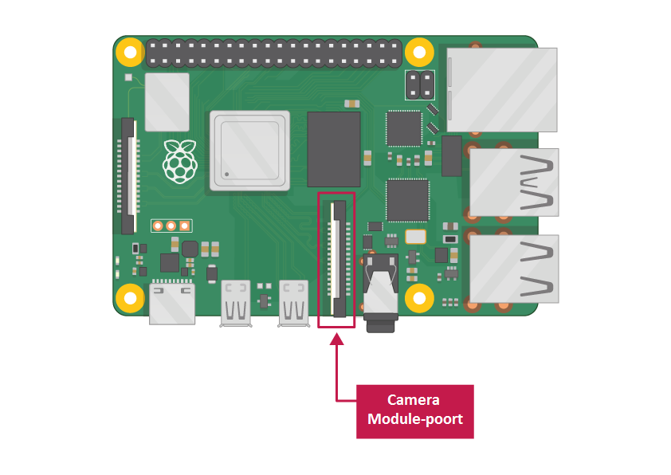

## Wat heb je nodig

### Raspberry Pi-computer met een cameramodulepoort

Alle huidige modellen Raspberry Pi hebben een poort voor het aansluiten van de cameramodule.

**Opmerking:** als je een Raspberry Pi Zero wilt gebruiken, heb je een Cameramodule-lintkabel nodig die past bij de kleinere poort van de Raspberry Pi Zero voor de cameramodule.

### Raspberry Pi-cameramodule

Er zijn twee versies van de cameramodule:

* [De standaardversie](https://www.raspberrypi.org/products/camera-module-v2/), die is ontworpen om foto's te maken bij normaal licht
* [De NoIR-versie](https://www.raspberrypi.org/products/pi-noir-camera-v2/), die geen infraroodfilter heeft, dus je kunt het samen met een infraroodlichtbron gebruiken om foto's te maken in het donker

