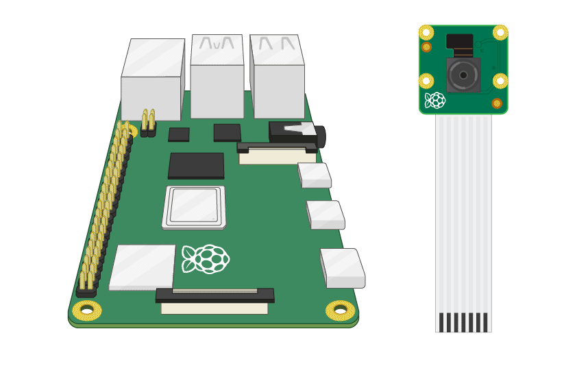
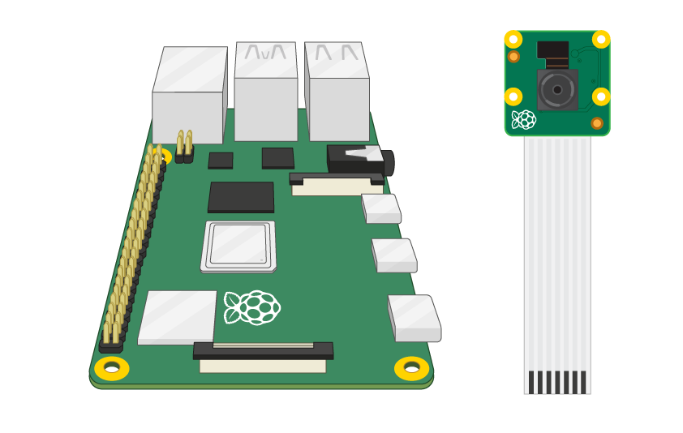
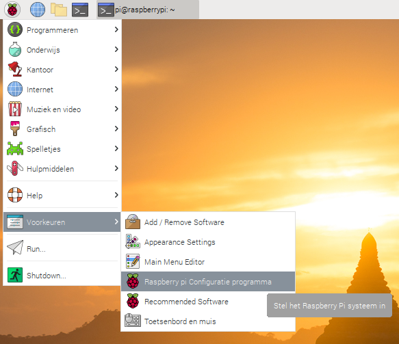
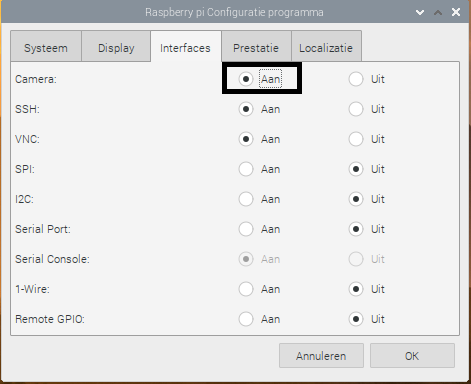

## Sluit de cameramodule aan

**Zorg ervoor dat je Raspberry Pi is uitgeschakeld.**

--- no-print ---

1. Zoek de poort van de cameramodule
2. Trek voorzichtig de randen van de plastic clip van de poort omhoog
3. Plaats de lintkabel van de cameramodule; zorg ervoor dat de kabel in de juiste richting is gedraaid
4. Druk de plastic klem terug op zijn plaats

--- /no-print ---

--- print-only ---

1. Zoek de poort van de cameramodule.

2. Trek voorzichtig de randen van de plastic clip van de poort omhoog.

3. Plaats de lintkabel van de cameramodule; zorg ervoor dat de kabel in de juiste richting is gedraaid.

4. Druk de plastic klem terug op zijn plaats.

--- /print-only ---

- Start de Raspberry Pi op.

- Ga naar het hoofdmenu en open het **Raspberry Pi-configuratie** programma.

    

- Selecteer het tabblad **interfaces** en zorg ervoor dat de camera **ingeschakeld** is:

    

- Start je Raspberry Pi opnieuw op.
