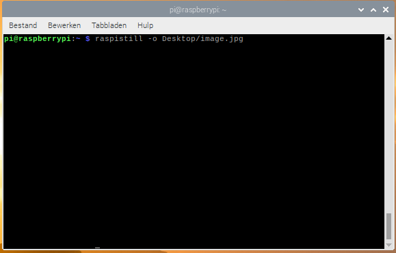
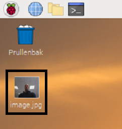

## De cameramodule bedienen via de opdrachtregel

Nu de cameramodule is aangesloten en de software is ingeschakeld, probeer dan de opdrachtregelprogramma's `raspistill` en `raspivid` uit.

- Open een terminalvenster door op het zwarte monitorpictogram op de taakbalk te klikken:


- Typ de volgende opdracht om een foto te maken en op het bureaublad op te slaan:

```bash
raspistill -o Desktop/image.jpg
```



- Druk op <kbd>Enter</kbd> om het commando uit te voeren.

Wanneer de opdracht wordt uitgevoerd, wordt het cameravoorbeeld vijf seconden geopend voordat er een foto wordt gemaakt.

- Zoek het pictogram van het afbeeldingsbestand op het bureaublad en dubbelklik op het pictogram om de afbeelding te openen.

    

Door verschillende opties toe te voegen, kun je de grootte en het uiterlijk van de afbeelding instellen die het `raspistill` commando maakt.

- Voeg bijvoorbeeld `-h` en `-w` toe om de hoogte en breedte van de afbeelding te wijzigen:

```bash
raspistill -o Desktop/image-small.jpg -w 640 -h 480
```

- Neem nu een video op met de cameramodule door het volgende `raspivid` commando te gebruiken:

```bash
raspivid -o Desktop/video.h264
```

- Om het videobestand af te spelen, dubbelklik je op het `video.h264` bestandspictogram op het bureaublad om het te openen in VLC Media Player.

Lees voor meer informatie en andere opties die je met deze commando's kunt gebruiken de [documentatie voor raspistill](https://www.raspberrypi.org/documentation/usage/camera/raspicam/raspistill.md) en de [documentatioe voor raspivid](https://www.raspberrypi.org/documentation/usage/camera/raspicam/raspivid.md).
