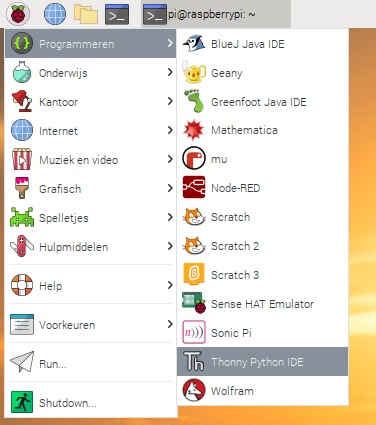

## De cameramodule bedienen met Python-code

Met de Python `picamera` bibliotheek kun je je cameramodule besturen en geweldige projecten maken.

- Open een Python 3 editor, zoals **Thonny Python IDE**:

    

- Open een nieuw bestand en sla het op als `camera.py`.

    **Opmerking:** het is belangrijk dat je **het bestand nooit opslaat als `picamera.py`**.

- Voer de volgende code in:

    ```python
    from picamera import PiCamera
    from time import sleep

    camera = PiCamera()

    camera.start_preview()
    sleep(5)
    camera.stop_preview()
    ```

- Sla je programma op en voer het uit. Het voorbeeld van de camera moet vijf seconden lang worden weergegeven en vervolgens weer worden gesloten.

    

    **Opmerking:** het voorbeeld van de camera werkt alleen als een monitor is aangesloten op de Raspberry Pi. Als je externe toegang gebruikt (zoals SSH of VNC), zie je het voorbeeld van de camera niet.

- Als je voorbeeld ondersteboven staat, kun je het met de volgende code 180 graden draaien:

    ```python
    camera = PiCamera()
    camera.rotation = 180
    ```

    Je kunt de afbeelding draaien met `90`, `180` of `270` graden. Om de afbeelding te resetten, stel je `rotation` in op `0` graden.

Het is het beste om het voorbeeld een beetje doorschijnend te maken, zodat je kunt zien of er fouten in je programma optreden terwijl het voorbeeld is ingeschakeld.

- Laat het voorbeeld van de camera zien door een `alpha`-niveau in te stellen:

    ```python
    camera.start_preview(alpha=200)
    ```

    De `alpha` waarde kan elk getal zijn tussen `0` en `255`.