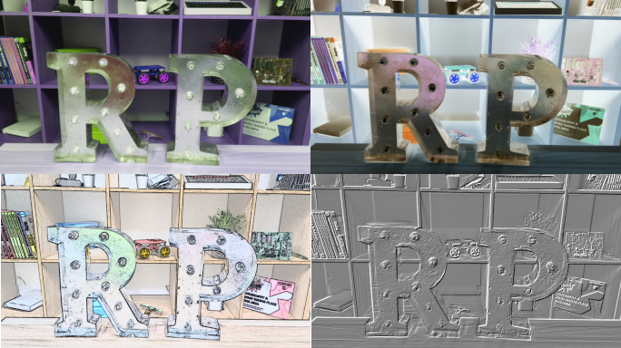

## Hoe je de beeldinstellingen kunt wijzigen en beeldeffecten kunt toevoegen

De Python `picamera` software biedt een aantal effecten en configuraties om te veranderen hoe je afbeeldingen eruit zien.

**Opmerking:** sommige instellingen hebben alleen invloed op het voorbeeld en niet op de gemaakte afbeelding, sommige hebben alleen invloed op de gemaakte afbeelding en veel andere op beide.

### Stel de beeldresolutie in

Je kunt de `resolutie` van de afbeelding die de cameramodule maakt wijzigen.

Standaard is de beeldresolutie ingesteld op de resolutie van je monitor. De maximale resolutie is 2592×1944 voor foto's en 1920×1080 voor video-opnamen.

- Gebruik de volgende code om de `resolutie` op maximum in te stellen en een foto te maken.

    **Opmerking:** je moet ook de framesnelheid instellen op `15` om deze maximale resolutie in te schakelen.

    ```python
    camera.resolution = (2592, 1944)
    camera.framerate = 15
    camera.start_preview()
    sleep(5)
    camera.capture('/home/pi/Desktop/max.jpg')
    camera.stop_preview()
    ```

De minimale resolutie is 64×64.

- Probeer een foto te maken met de minimale resolutie.

### Voeg tekst toe aan je afbeelding

Je kunt tekst aan je afbeelding toevoegen met de opdracht `annotate_text`.

- Voer deze code uit om het uit te proberen:

    ```python
    camera.start_preview()
    camera.annotate_text = "Hallo wereld!"
    sleep(5)
    camera.capture('/home/pi/Desktop/text.jpg')
    camera.stop_preview()
    ```

### Wijzig het uiterlijk van de toegevoegde tekst

- Stel de tekstgrootte in met de volgende code:

    ```python
    camera.annotate_text_size = 50
    ```

    Je kunt de tekstgrootte instellen op alles tussen `6` en `160`. De standaardgrootte is `32`.

Het is ook mogelijk om de tekstkleur te wijzigen.

- Voeg eerst `Color` toe aan de `import` regel bovenaan het programma:

    ```python
    from picamera import PiCamera, Color
    ```

- Wijzig vervolgens onder de regel `import` de rest van je code zodat het er zo uitziet:

    ```python
    camera.start_preview()
    camera.annotate_background = Color('blue')
    camera.annotate_foreground = Color('yellow')
    camera.annotate_text = " Hallo wereld "
    sleep(5)
    camera.stop_preview()
    ```

### Wijzig de helderheid van het voorbeeld

Je kunt wijzigen hoe helder het voorbeeld wordt weergegeven. De standaard helderheid is `50`, en je kunt deze instellen op elke waarde tussen `0` en `100`.

* Voer de volgende code uit om dit uit te proberen:

    ```python
    camera.start_preview()
    camera.brightness = 70
    sleep(5)
    camera.capture('/home/pi/Desktop/bright.jpg')
    camera.stop_preview()
    ```

- De volgende lus past de helderheid aan en voegt ook tekst toe om het huidige helderheidsniveau weer te geven:

    ```python
    camera.start_preview()
    for i in range(100):
        camera.annotate_text = "Helderheid: %s" % i
        camera.brightness = i
        sleep(0.1)
    camera.stop_preview()
    ```

### Wijzig het contrast van het voorbeeld

Net als de helderheid van het voorbeeld kun je het contrast van het voorbeeld wijzigen.

- Voer de volgende code uit om dit uit te proberen:

    ```python
    camera.start_preview()
    for i in range(100):
        camera.annotate_text = "Contrast: %s" % i
        camera.contrast = i
        sleep(0.1)
    camera.stop_preview()
    ```

### Voeg coole beeldeffecten toe

Je kunt `camera.image_effect` gebruiken om een bepaald beeldeffect toe te passen.

De opties voor beeldeffecten zijn:

* `none (geen)`
* `negative (negatief)`
* `solarize (overbelichten)`
* `sketch (schets)`
* `denoise (kleurruis verwijderen)`
* `emboss (reliëf)`
* `oilpaint (olieverf)`
* `hatch (arcering)`
* `gpen (potlood)`
* `pastel`
* `watercolor (waterverf)`
* `film`
* `blur (vervagen)`
* `saturation (verzadiging)`
* `colorswap (kleurwisseling)`
* `washedout (uitgewassen)`
* `posterise (posterstijl)`
* `colorpoint (kleurpunt)`
* `colorbalance (kleurbalans)`
* `cartoon`
* `deinterlace1`
* `deinterlace2`

Het standaardeffect is `none`.

* Kies een beeldeffect en probeer het uit:

    ```python
    camera.start_preview()
    camera.image_effect = 'colorswap'
    sleep(5)
    camera.capture('/home/pi/Desktop/colorswap.jpg')
    camera.stop_preview()
    ```

* Voer deze code uit om **alle** beeldeffecten uit `camera.IMAGE_EFFECTS` te herhalen:

    ```python
    camera.start_preview()
    for effect in camera.IMAGE_EFFECTS:
        camera.image_effect = effect
        camera.annotate_text = "Effect: %s" % effect
        sleep(5)
    camera.stop_preview()
    ```

    

### Stel de belichtingsmodus in

Je kunt `camera.exposure_mode` gebruiken om de belichting in te stellen op een bepaalde modus.

De opties voor de belichtingsmodus zijn:
* `off (uit)`
* `auto`
* `night (nacht)`
* `nightpreview (nachtvoorbeeld)`
* `backlight (achtergrondverlichting)`
* `spotlight (schijnwerper)`
* `sports (sporten)`
* `snow (sneeuw)`
* `beach (strand)`
* `verylong (heel lang)`
* `fixedfps (vaste fps)`
* `antishake (beeldstabilisatie)`
* `fireworks (vuurwerk)`

De standaardmodus is `auto`.

* Kies een belichtingsmodus en probeer het uit:

    ```python
    camera.start_preview()
    camera.exposure_mode = 'beach'
    sleep(5)
    camera.capture('/home/pi/Desktop/beach.jpg')
    camera.stop_preview()
    ```

* Je kunt alle belichtingsmodi doorlopen met `camera.EXPOSURE_MODES`, zoals je deed voor de beeldeffecten.

### Wijzig de witbalans van de afbeelding

Je kunt `camera.awb_mode` gebruiken om de automatische witbalans in te stellen op een vooraf ingestelde modus.

De beschikbare automatische witbalans-modi zijn:
* `off (uit)`
* `auto`
* `sunlight (zonlicht)`
* `cloudy (bewolkt)`
* `shade (schaduw)`
* `tungsten (wolfraam)`
* `fluorescent (fluorescerend)`
* `incandescent (gloeilamp)`
* `flash (flitser)`
* `horizon`

De standaard is `auto`.

* Kies een automatische witbalans en probeer het uit:

    ```python
    camera.start_preview()
    camera.awb_mode = 'sunlight'
    sleep(5)
    camera.capture('/home/pi/Desktop/sunlight.jpg')
    camera.stop_preview()
    ```

* Je kunt met `camera.AWB_MODES` alle automatische witbalansmodi doorlopen, net zoals bij de beeldeffecten.