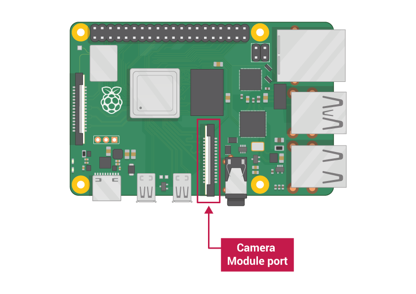

## O que você vai precisar

### Computador Raspberry Pi com uma porta Módulo de Câmera

Todos os modelos atuais do Raspberry Pi possuem uma porta para conectar o Módulo de Câmera.

**Nota:** Se você deseja usar um Raspberry Pi Zero, você precisa de um cabo flat para Módulo de Câmera que se encaixe na porta menor do Módulo de Câmera do Raspberry Pi Zero.

### Módulo de Câmera Raspberry Pi

Existem duas versões do Módulo de Câmera:

* [A versão padrão](https://www.raspberrypi.org/products/camera-module-v2/), que é projetada para tirar fotos em iluminação natural
* [A versão NoIR](https://www.raspberrypi.org/products/pi-noir-camera-v2/), que não possui um filtro infravermelho, de modo que você possa usá-la junto com uma fonte de luz infravermelha para tirar fotos no escuro

