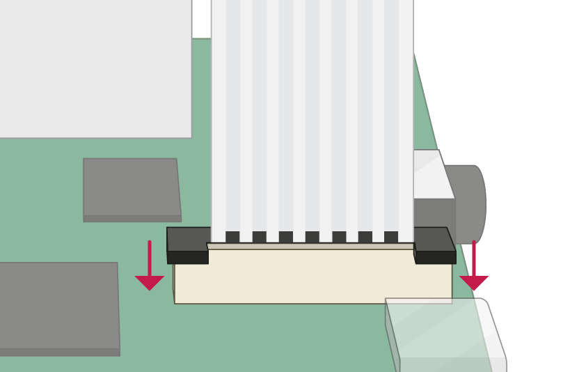
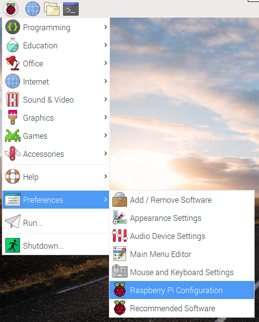

## Conectar o Módulo de Câmera

**Certifique-se de que o Raspberry Pi esteja desligado.**

--- no-print ---

1. Localize a porta do Módulo de Câmera
2. Levante suavemente as bordas do clipe plástico da porta
3. Insira o cabo flat do Módulo de Câmera; certifique-se de que o cabo esteja do lado correto
4. Empurre o clipe plástico de volta ao lugar

--- /no-print ---

--- print-only ---

1. Localize a porta do Módulo de Câmara.

2. Levante suavemente as bordas do clipe plástico da porta.

3. Insira o cabo flat do Módulo de Câmera; certifique-se de que o cabo esteja do lado correto.

4. Empurre o clipe plástico de volta ao lugar.

--- /print-only ---

- Inicie o seu Raspberry Pi.

- Vá para o menu principal e abra a ferramenta **Configuração do Raspberry Pi**.

    

- Selecione a guia **Interfaces** e certifique-se de que a câmera esteja **habilitada**:

    

- Reinicie o seu Raspberry Pi.
