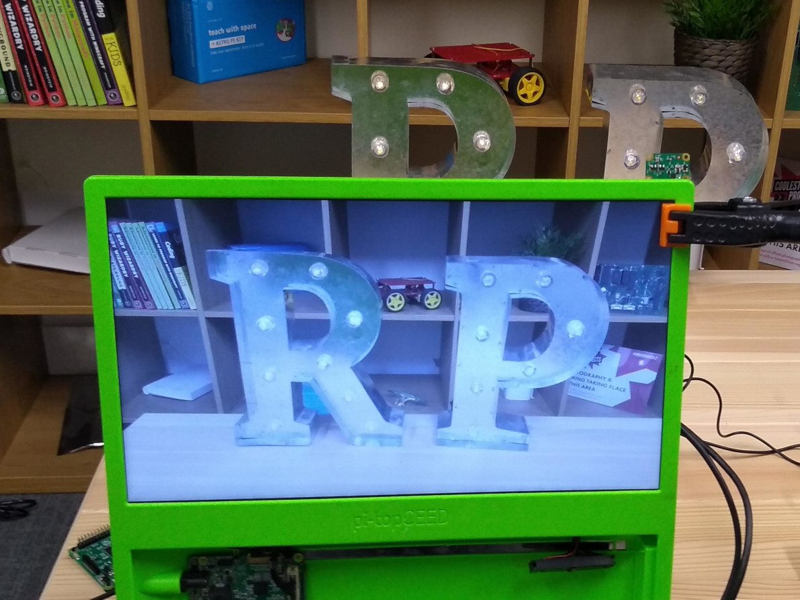

## Como controlar o Módulo de Câmera com código Python

A biblioteca Python `picamera` permite que você controle seu Módulo de Câmera e crie projetos incríveis.

- Abra um editor Python 3, como **Thonny Python IDE**:

    

- Abra um novo arquivo e salve-o como `camera.py`.

    **Nota:** é importante que você **nunca salve o arquivo como `picamera.py`**.

- Insira o seguinte código:

    ```python
    from picamera import PiCamera
    from time import sleep

    camera = PiCamera ()

    camera.start_preview ()
    sleep (5)
    camera.stop_preview ()
    ```

- Salve e execute seu programa. A pré-visualização da câmera deve ser mostrada por cinco segundos e, em seguida, fechada novamente.

    

    **Nota:** a pré-visualização da câmera só funciona quando um monitor está conectado ao seu Raspberry Pi. Se estiver usando acesso remoto (como SSH ou VNC), você não verá a pré-visualização da câmera.

- Se sua pré-visualização estiver de cabeça para baixo, você pode girá-la 180 graus com o seguinte código:

    ```python
    camera = PiCamera()
    camera.rotation = 180
    ```

    Você pode girar a imagem em `90`, `180`, ou `270` graus. Para redefinir a imagem, defina `rotation` como `0` graus.

É melhor deixar a pré-visualização um pouco transparente para que você possa ver se ocorrem erros no seu programa enquanto a visualização estiver ativa.

- Torne a pré-visualização da câmera transparente definindo um nível `alfa`:

    ```python
    camera.start_preview(alpha=200)
    ```

    O valor `alpha` pode ser qualquer número entre `0` e `255`.