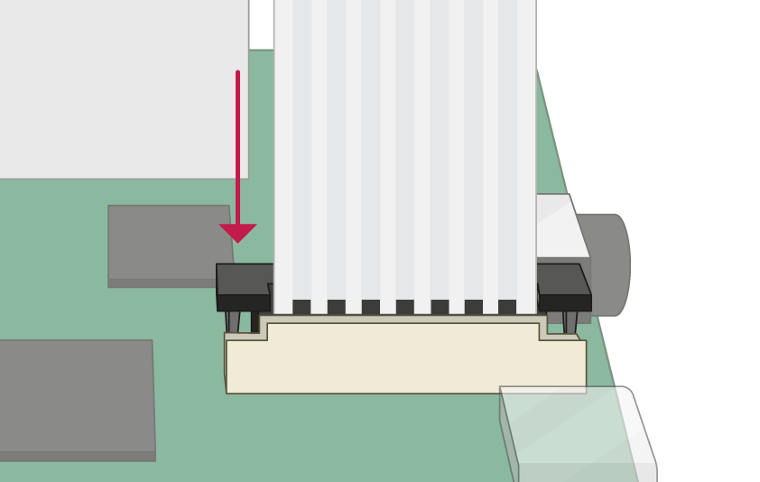

## Connect the Camera Module

**Ensure your Raspberry Pi is turned off.**

--- no-print ---

1. Locate the Camera Module port
2. Gently pull up on the edges of the port's plastic clip
3. Insert the Camera Module ribbon cable; make sure the cable is the right way round
4. Push the plastic clip back into place

--- /no-print ---

--- print-only ---

1. Locate the Camera Module port.

2. Gently pull up on the edges of the port's plastic clip.

3. Insert the Camera Module ribbon cable; make sure the cable is the right way round.

4. Push the plastic clip back into place.

--- /print-only ---

- Start up your Raspberry Pi.

- Go to the main menu and open the **Raspberry Pi Configuration** tool.

    

- Select the **Interfaces** tab and ensure that the camera is **enabled**:

    

- Reboot your Raspberry Pi.
